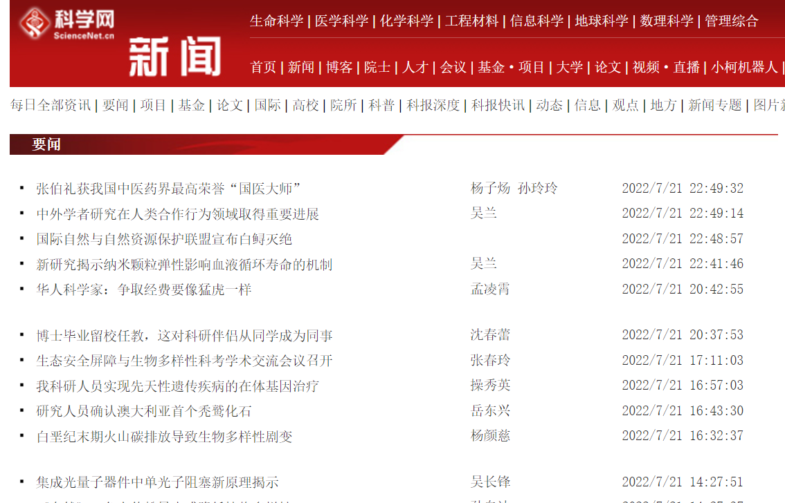
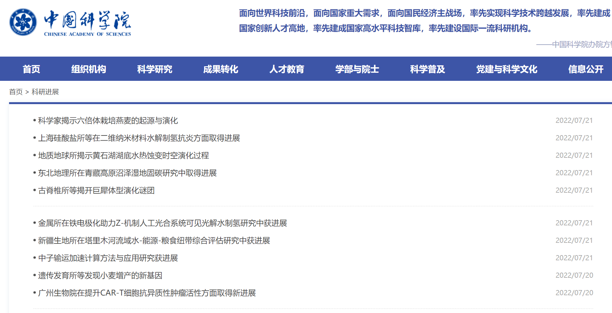
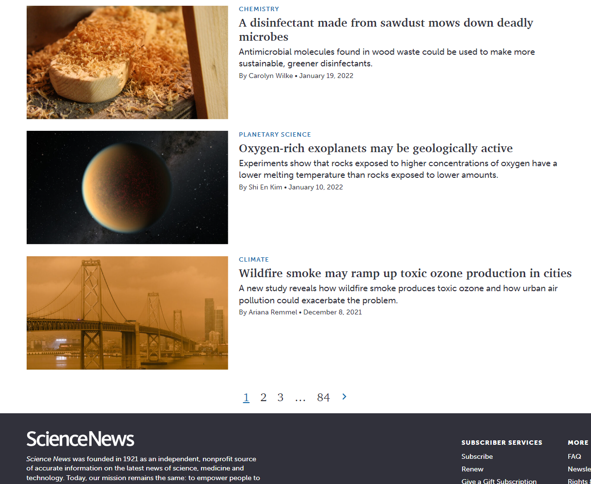
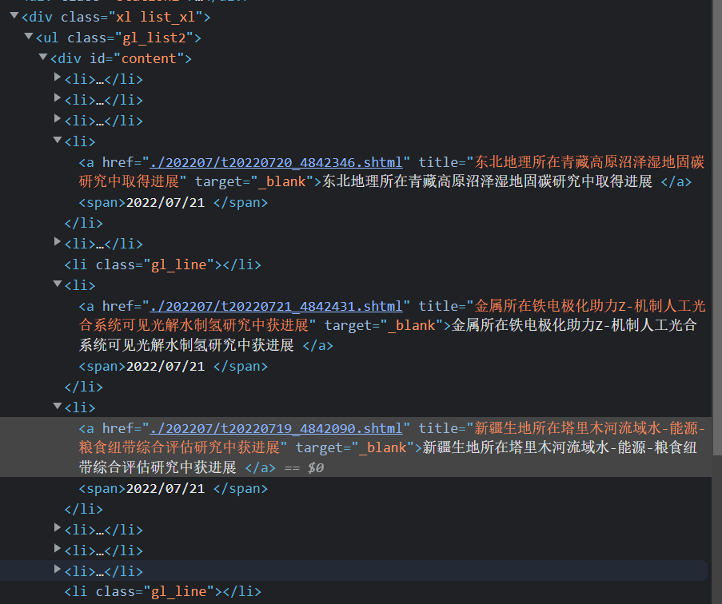
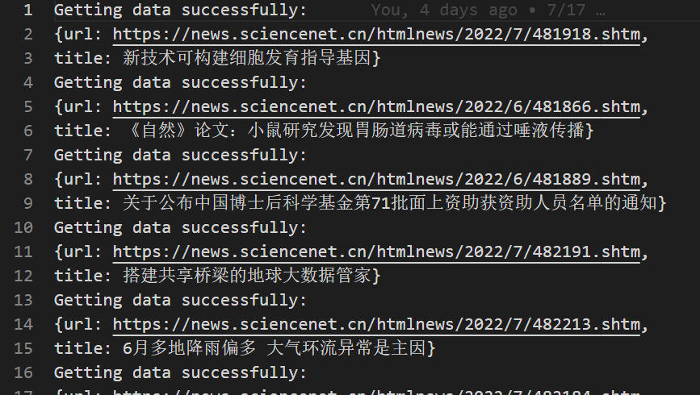
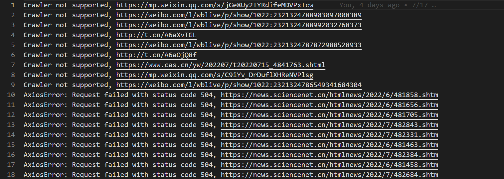
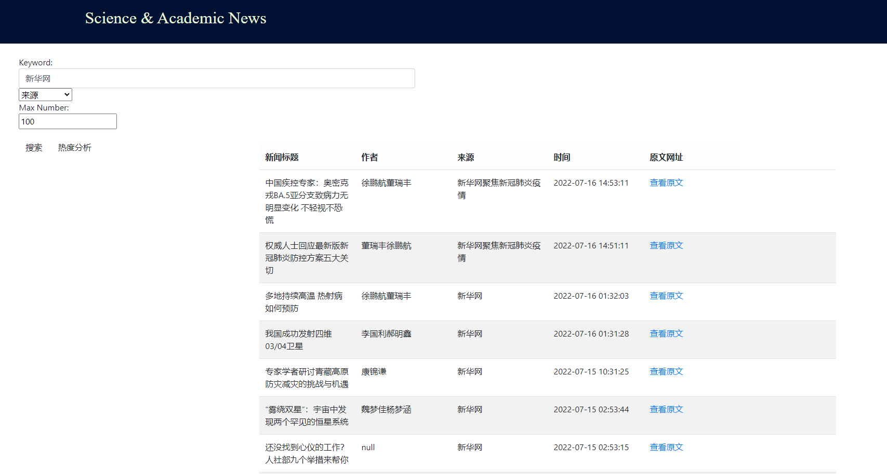
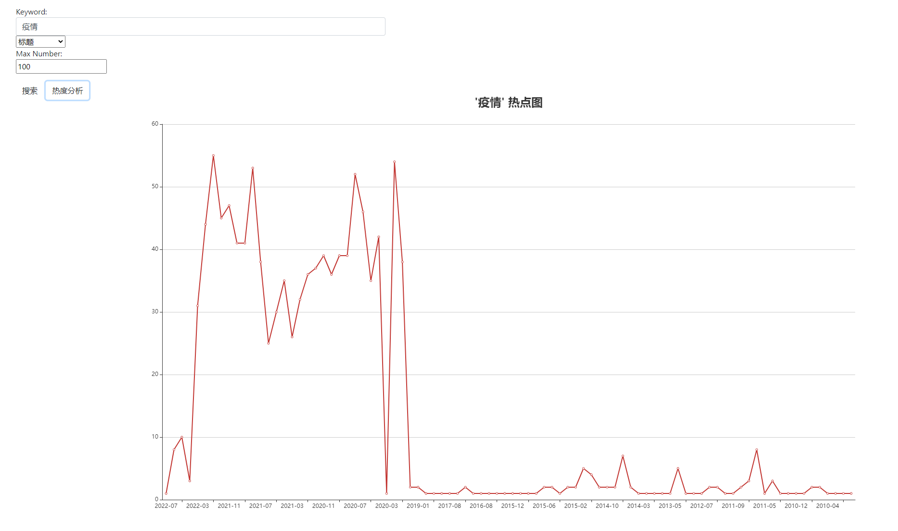

# 科学、学术新闻展示项目开发报告

- web编程期末作业
- 2022/7/22
- [GitHub](https://github.com/Ghostlikei/Crawler_ECNU)

---

### 作业要求

- 新闻爬虫及爬取结果的查询网站

- 核心需求：

1、选取3-5个代表性的新闻网站（比如新浪新闻、网易新闻等，或者某个垂直领域权威性的网站比如经济领域的雪球财经、东方财富等，或者体育领域的腾讯体育、虎扑体育等等）建立爬虫，针对不同网站的新闻页面进行分析，爬取出编码、标题、作者、时间、关键词、摘要、内容、来源等结构化信息，存储在数据库中。

2、建立网站提供对爬取内容的分项全文搜索，给出所查关键词的时间热度分析。

- 技术要求：

1、必须采用Node.JS实现网络爬虫

2、必须采用Node.JS实现查询网站后端，HTML+JS实现前端（尽量不要使用任何前后端框架）

### 目标

开发一个新闻爬取项目，提供全文搜索，关键词时间热度分析

- 拟采用以下技术：
  - 使用HTML和JS实现前端搭建
  - 后端采用node.js进行控制
  - 由于技术限制，采用windows10作为平台开发
- 爬虫部分：
  - 尝试编写多线程爬虫，实现不了就暂时采用单线程
  - 对于每个网站的爬虫分别封装并进行单独控制
  - 爬取的内容存储在数据库当中，考虑使用MySQL作为后端数据库
  - 对于爬取条目导出爬取日志，方便进行手动控制
- 前端网页
  - 提供查询功能，关键词的时间热度分析图表，给出查询内容，能够返回一个有图表和新闻列表的网页
  - 图表采用echarts组件进行绘制


## 爬虫部分

- 本次爬虫的设计是要考虑一次性爬取全站的数据，追求极致的效率

#### **STEP1**：爬取网站的确定

垂直领域定义为**科学、学术**领域的网站新闻，通过浏览器的检索功能，确定了三个**主流，结构相似**的新闻网站：[科学网](http://www.sciencenet.cn/)，[中国科学院网](https://www.cas.cn/)，以及为了支持英文搜索去爬取的[ScienceNet](https://www.sciencenews.org/)

选取这三个网站的主要原因是：结构相似（都是列表结构），（几乎）没有反爬手段，新闻量足够







- 网站的反爬手段越多，爬虫需要的组件越多，设计难度和稳定性控制要求越高

#### **STEP2**：简要估计爬取的条目数量

 这一步其实非常重要，出于时间的考虑，数据的规模决定了爬虫的设计模式

  - 科学网https://news.sciencenet.cn/topnews-2.aspx“要闻”全部条目全部爬取，预计75849条
  - 中国科学院网
    - 科研进展条目https://www.cas.cn/syky/index.shtml预计3000+
    - 每日科学条目https://www.cas.cn/kj/index.shtml预计3000+
  - ScienceNews，分topic，会有重复，预计27000条
    - chemistryhttps://www.sciencenews.org/topic/chemistry/page/2 预计900-1000条，尾页84
    - earth https://www.sciencenews.org/topic/earth/page/2 预计4000条，尾页299
    - humans https://www.sciencenews.org/topic/humans/page/2 预计8000条，尾页704
    - life https://www.sciencenews.org/topic/life/page/2 预计6000-7000条，尾页582
    - math https://www.sciencenews.org/topic/math/page/2 预计700-800条，尾页64
    - physics https://www.sciencenews.org/topic/physics/page/2 预计2000条，尾页188
    - science-society https://www.sciencenews.org/topic/science-society/page/2 预计1200条，103
    - space https://www.sciencenews.org/topic/space/page/2 预计3000条，尾页279
    - tech https://www.sciencenews.org/topic/tech/page/2 预计1200条，尾页106

  #### STEP3：根据数据的规模和网站的情况来设计爬虫

- 预计数据的条目数量超过10w条，所以多线程的爬虫优势会非常明显
- 由于这三个网站的结构都是**列表页-->内容页**，设计一个爬虫结构可以重复使用



#### STEP4：选择工具并且编写爬虫

- 所有的爬虫都分为三个部分，**网页抓取**，**数据解析**，和**数据存储**

- 因为考虑使用多线程的高性能爬虫，所以采用`axios`模块设计爬虫抓取部分

- 解析库使用的是`cheerio`，相比`jquery`封装的更好，当然解析库用什么都是无所谓的，只需要效率高于爬取效率即可

- 数据库采用的是本地的mysql，由于之前使用的都是NOSQL数据库，这次是第一次尝试，希望让自己的sql语句和操作更加熟练一点

- 对于全部爬取的条目，成功和失败都导出一份日志，方便进行手动的操作

  成功日志




​	失败日志



手动控制的意思就是，例如上图中的`AxiosError`就可以手动读取条目进行重新爬取

#### 爬虫内容展示

用ES8的新特性`async/await`来构建期约链更加的简单

以下爬虫只是一个sample，能启动的项目在个人的GitHub仓库当中

- 获取列表页

```js
async function getNewsHtml(listUrl){
    try{
        const resp = await axios.get(listUrl,config);
        return resp.data;
    }
    catch(err){
        fs.writeFileSync("./error_log.txt",`${err}, ${listUrl}\n`,{flag:"a+"});
    }
}
```

- 解析列表页，返回一个装有内容页url的数组

cheerio的选择器和jquery是一样的

```js
async function getNewsLinks(listUrl){
    try{
        const html = await getNewsHtml(listUrl);
        const $ = cheerio.load(html);
        let anchor = $("div ol li div h3 a");//解析爬取的链接
        
        const links = anchor.map((i, ele) => {
            const href = ele.attribs["href"];
            return href;
        })
        console.log(`Fetching page: ${listUrl}`);
        return links;
    }
    catch(err){
        fs.writeFileSync("./error_log.txt",`${err}, ${listUrl}\n`,{flag:"a+"});
    }
    
}
```

- 单独写一个解析、存储内容页的异步函数

```js
async function getData(newsUrl){
    try{
        let SUCCESS = true;
        const resp = await axios.get(newsUrl, config);
        const $ = cheerio.load(resp.data);
        //此处省略解析数据部分
        let sql = `INSERT INTO sciencenews VALUES("${title}", "${author}", "${source}", "${time}", "${article}", "${url}", "${essay}");`;
        connection.query(sql, (err, result) =>{
            if(err){
                SUCCESS = false;
                fs.writeFileSync("./error_log.txt",`${err}, ${newsUrl}\n`,{flag:"a+"});
                return;
            }
        })//存储数据
        if(SUCCESS) fs.writeFileSync("./crawl_log.txt",`Getting data successfully:\nurl: ${url}\n`,{flag:"a+"});
        return {};//返回数据的json
    }
    catch(err){
        fs.writeFileSync("./error_log.txt",`${err}, ${newsUrl}\n`,{flag:"a+"});
    }
}
```

- 解析的部分采用cheerio选择器+正则表达式配合的方式，更加高效

需要解析的元素可以在浏览器中打开F12后，右键元素选择检查，之后再对选中的内容右键Copy Selector后放入选择器，这样比较快捷，当然这样的兼容性是不如手写选择器的，能手写尽量还是手写

对于选择器和正则的调试需要在单独的脚本里进行，通过轻量级的爬虫测试会比较方便快捷

下面是一段解析的示例，会提供编写的思路

```js
//获取标题元素，去除左右两边的空白
let title = $('table tbody tr:nth-child(3) td').text().replace(/(^\s*)|(\s*$)/g, "");
//获取来源元素
let source = $('tbody tr:nth-child(1) td div a').text();
//通过info来获取一些文章信息，
let author = '';
let info = $('tbody tr:nth-child(1) td[align="left"] div:nth-child(1)').text().replace(/(^\s*)|(\s*$)/g, "");
if (info.slice(0,2) !== '作者'){
    author = null;
} else {
    author += info.match(/：.*[\u6765][\u6e90]：/g)[0];//正则匹配获得作者，中文正则请用unicode编码
    author = author.replace(/\uff1a/g,"").replace(/\u6765\u6e90/g, "").replace(' ','');//去掉多余元素
}

let time = info.match(/\d+[/-]\d+[/-]\d+\s\d+[:]\d+[:]\d+/g);//为了防止indexerror，先看一下时间有没有
if(!time){
    time = info.match(/\d+[/-]\d+[/-]\d+/g)[0];//正则匹配取得时间元素
} else {
    time = info.match(/\d+[/]\d+[/]\d+\s\d+[:]\d+[:]\d+/g)[0];
}

let article = $('p').text().replace("\t", "");//取得文章内容
let url = newsUrl;
```

解析函数的设计思维就是尽可能的提高兼容性，但是也不是说要去满足每一个页面的要求，获得的信息都是完美的，这是不可能的，这也是为什么要用try和catch以及导出日志的原因

- 最后通过一个异步函数对前面两个函数进行拼装

```js
async function fetchAll(listUrl){
    const links = await getNewsLinks(listUrl);
    try{
        const proms = links.map((link) => {
            return getData(links[link]);
        });

        return Promise.all(proms);
    }
    catch(err){
        fs.writeFileSync("./error_log.txt",`${err}\n`,{flag:"a+"});
    }

```

至此整个期约链构建完毕，获取列表页面---解析列表页面---对于每个页面爬取----解析页面----存储数据

- 最后通过一个主函数和相关参数来控制整个爬虫程序

在这之前，js是没有sleep函数的，如果需要控制间隔需要自行搭建一个异步的sleep函数

```js
const sleep = (timeout) => {
    return new Promise((resolve)=>{
      setTimeout(()=>{
        resolve();
      }, timeout)
    })
}
```

最后通过参数来控制主函数

```js
let start_page = 1;
let end_page = 100;
let wait = 25000;// 设置睡眠时间，防止io过大
let number = 10;//一次爬取的条目页数，单次开启的线程数量=number*单页连接数
async function main(){
    for(let j = 1; j <= 1000; j++){
        for(let i = start_page; i < start_page+number; i++){
            fetchAll(`https://www.sciencenews.org/topic/tech/page/${i}`);   
        }
        await sleep(wait);
        if(start_page-number >= end_page){
            console.log("抓取结束！");
            connection.end();
            return;
        }
        start_page += number;
    } 
    console.log("抓取结束！");
    connection.end();
}
main();
```

爬虫效率：以单页20条，一次爬取20页，间隔20秒为例，理论上一小时可以爬取72000条

设置爬取的页数取决于服务器的性能，爬取休息的时间取决于自己和对方服务器之间的传输速度

#### 爬取结果

在同时开三个爬虫的情况下，在一个小时之内爬取了科学网数据61614条，中国科学院官网数据13227条，ScienceNews数据34309条，失败预计6000条左右，共计109510条数据，全部存储于同一个表格sciencenews中

之所以没有分开存储，是因为爬取的网站并不是**新闻源**网站，如果要查找相应的新闻源可以通过source关键字来进行查询

#### 补充

- 汇报的过程当中老师提到了线程卡死的问题，具体就是同时开几百几千个线程会出现线程卡死的问题，尽管在实际爬取的过程中并没有出现，这个问题确实是存在的，即使代码中已经做了很多安全处理，比如用更加安全的async/await导出爬取日志，设置timeout等等，但是如果不直接去监听线程的状态也会出现问题，解决的方案可能考虑编写一个监听线程的函数，或者去自己封装一个线程池来进行操作，是可以考虑的
- 这个爬虫只能应对一些反爬做的不好的网站，如果面对数据下毒，封ip，验证这些手段的时候需要更多的组件加入，比如ip池，验证组件，自动化组件等等，具体网站要具体分析
- 具体学习爬虫的话可以去看一些有关爬虫的书本，个人体验下来Javascript由于语言的特性，以及对前端的适配性，拿来写简易的爬虫是最方便的


## 网站架构

- 采用express框架进行前后端的连接，具体的操作可以参考其他教程，需要注意的是最好把前端和后端需要的模块全部安装到express项目当中，这样代码的复用性更强一点

- 其实框架这部分是尝试了很久的，本来是想纯用ajax来实现这一个页面，尝试了几天失败之后还是用了框架，当然如果时间有余可以像其他的一些同学去学一点主流的框架，比如react，vue，angular这些都是很不错的
- 本次一共需要导入三个cdn，分别是jquery，bootstrap和echarts，均可在官网上查询到最新的编译版本

#### 查询列表

- 后端部分

```js
router.get('/process_get', (req, resp) =>{
    let ori = req.query.keyword.split(",");//传入两个参数，分别是查询的条目和关键字
    let arg = ori[0];
    let item = ori[1];
    let sql = `SELECT DISTINCT title, author, source, upload_time, html\
    from sciencenews where ${item} like '%${arg}%' ORDER BY upload_time DESC`;//向数据库发送请求，按照时间降序排列，因为没有去重所以需要distinct关键字
    mysql.query(sql, (err, result, fields) =>{
      resp.writeHead(200, {"Content-Type": "application/json"});

      resp.write(JSON.stringify(result));
      resp.end();
    });
});
```

在实际操作的时候也是碰到一些问题的，比如like查询%前后需要加入引号，以及条件语句要注意顺序等等

可以在本地的mysql cmd当中尝试一下语句的正确性，这样发现错误比较方便，调试的时候个人的习惯是用console.log来输出一些结果，因为共用js和html的话断点不是很会用，如果会用的同学直接debug是最好的

- 前端部分

```html
//html组件，查询变量全部放在表单里面
<div class="searchContainer">
        <form role="form">
            <div class="form-group">
                <br>Keyword:<br>
                <input type="text" class="form-control" id="keyword" placeholder="请输入关键字">
                <select class="form-select" aria-label="Default select example">
                    <option selected>Select Item</option>
                    <option value="author">作者</option>
                    <option value="title">标题</option>
                    <option value="article">正文</option>
                    <option value="source">来源</option>
                </select>
                <br>Max Number:<br>
                <input type="number" id="number" placeholder="最大查询数量">
            </div>
            <button type="button" id="search" class="btn btn-default">搜索</button>
            <button type="button" id="chart" class="btn btn-default">热度分析</button>
        </form>
    </div>
```

```js
// js组件
$(document).ready(function() {
        $('button[id="search"]').click(function() {
            $.get('/process_get?keyword='+$('input:text').val()+","+item, function(data){
                $('table').empty();
                
                $("table").append('<tbody>');
                $("table").append('<tr class="news table-light"><th>新闻标题</th><th>作者</th><th>来源</th><th>时间</th><th>原文网址<a>        </a></th></tr>');//写出标题栏
                let cnt0 = 0;
                
                for (let list of data) {
                    // 对数据库当中的数据进行一定的处理
                    let cnt1 = 0;
                    let table = '<tr class="news table-hover"><td>';
                    for(let element of Object.values(list)){
                        if(cnt1 <= 1){
                            table += (element + '</td><td>');
                        } else if(cnt1 === 2){
                            table += (element.replace(/[\s]/g, "") + '</td><td>');
                        } else if(cnt1 === 3){
                            table += (element.replace('T'," ").replace(".000Z","") + '</td><td>');
                        } else {
                            table += (`<a href="${element}">查看原文</a></td><td>`);
                        }
                        cnt1++;
                    }
                   
                    $("table").append(table + '</td></tr>');
                    cnt0++;
                    if($('input[type="number"]').val() > 0){
                        if(cnt0 >= $('input[type="number"]').val()) break;
                    }
                }
                $("table").append('</tbody>')

                
            });
        });
    });  
```

- 实际的效果



#### 热度分析

- 后端部分

直接采用sql语句把数据进行分组，不需要额外编写脚本来处理数据

```js
router.get('/chart', (req, resp) =>{
  let ori = req.query.keyword.split(",");
  let arg = ori[0];
  let item = ori[1];
  let sql = `SELECT DATE_FORMAT(upload_time, '%Y-%m') AS date, COUNT(*) AS num\
  from sciencenews where ${item} like '%${arg}%' GROUP BY date  ORDER BY upload_time DESC`;
  mysql.query(sql, (err, result, fields) =>{
    resp.writeHead(200, {"Content-Type": "application/json"});
    resp.write(JSON.stringify(result));
    resp.end();
  });
});
```

用date_format函数来分组，count函数来统计数量，最后返回值按照时间倒序排列

date_format里面的第二个参数`'%Y-%m'`是分组依据，可以通过前端的接口进行更改，因为时间的原因没有再去做这个功能

- 前端部分，只需要画图就可以了

```js
$(document).ready(function() {
        $('button[id="chart"]').click(function() {
            $.get('/chart?keyword='+$('input:text').val()+","+item, function(data){
                $('table').empty();
                var chart = echarts.init(document.getElementById('main'));
                var x_axis = [];
                var y_axis = [];
                for(let list of data){
                    x_axis.push(list.date);
                    y_axis.push(list.num);
                }
                var option = {
                    title:{
                        text: `'${$('input:text').val()}' 热点图`,
                        x: 'center',
                        textStyle:{
                            fontSize: 24
                        }
                    },
                    xAxis:{
                        type:'category',
                        data:x_axis
                    },
                    yAxis:{
                        type:'value'
                    },
                    series:[
                        {
                            type:'line',
                            data:y_axis
                        }
                    ]
                }
                chart.setOption(option);
            });
        });
    });  
```

- 实际效果



## 总结

- 开发的过程其实是比较困难的，但是总体上还是达成了要求，前端部分的设计和功能有时间的话还可以改进很多
- 个人还是非常喜欢这个作业的，经历了一次全栈式web设计，虽然只是最简单的一些组件，但是对于前端的学习还是收获了很多。因为爬虫的部分之前有项目经验，所以换一个语言也想重新设计一整个高效的爬虫，也想把有限的时间和经历去放在这一块的内容上，结果看来还算是比较成功的
- 如果可以的话还可以对一些功能进行完善，比如前端多项查询，分页等等，后端的数据库维护和爬虫的定时启动，ip池的封装，以及时间更多的话可以去尝试把这个项目部署在虚拟机的服务器上，或者是在线的一些服务器上面
- 前端还有非常非常多的内容亟待学习


